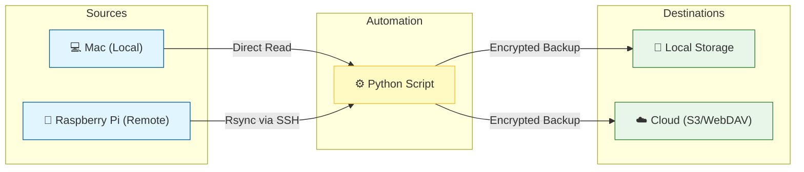

# Secure Mac & Server Backup Automation

**Purpose**: A secure, automated system to backup Macs and remote servers (like Raspberry Pis) to multiple destinations (Local HDD, S3, WebDAV/Yandex.Disk) using `restic`.



## 🛡️ Solution Overview

This project wraps `restic` and `rsync` in a Python automation layer to handle multi-source and multi-destination backups securely.

### Advantages
*   **Security First**: No passwords stored in config files. Uses **1Password CLI** (`op`) to fetch repo keys on-the-fly.
*   **Flexibility**: Backs up **Local Folders** directly and **Remote Servers** (via `rsync` mirroring).
*   **Multi-Target**: Push backups to **Local Disks** and **Cloud Storage** (S3, Yandex.Disk via `rclone`) simultaneously.
*   **Smart Excludes**: Powerful exclude patterns (e.g., `*.tmp`, `node_modules`) to save space.
*   **Verification**: Built-in tools to verify integrity (`check`) and unlock stale locks.

### Disadvantages/Trade-offs
*   **Storage**: Remote backups verify integrity by first mirroring files locally using `rsync`. This requires temporary local disk space equal to the size of the remote backup source.
*   **Dependencies**: Requires setting up `op` CLI and `restic` initially.

## 📦 Prerequisites

Ensure these are installed and available in your `$PATH`:

1.  **[uv](https://github.com/astral-sh/uv)**: Python package and project manager.
2.  **[restic](https://restic.net/)**: The core backup tool.
3.  **[1Password CLI (`op`)](https://developer.1password.com/docs/cli/)**: For secure password retrieval.
4.  **[rsync](https://rsync.samba.org/)**: For fetching data from remote servers. **Note**: `rsync` must be installed on **both** the local machine and the remote server. (`sudo apt-get update && sudo apt-get install -y rsync`)
5.  **[rclone](https://rclone.org/)** (Optional): If backing up to WebDAV/Cloud targets.

## 🚀 Usage Examples

### 1. Configuration (`servers.yaml`)
Define your sources and destinations. See [`sample.servers.yaml`](sample.servers.yaml) for a full reference.

```yaml
- name: "my-macbook"
  host: "localhost"
  paths: ["/Users/user/Documents"]
  repositories:
    - name: "yandex"
      path: "rclone:webdav:backups/mac"
      password_command: "op item get 'Repo Key' --fields password"
```

### 2. Run Backup
Backs up all configured servers to all repositories sequentially.
```bash
make backup
```

### 3. Restore Files
List snapshots for a specific server and repository, then restore.
```bash
# List snapshots
uv run --with PyYAML src/restore.py --list my-macbook --repo yandex

# Restore specific snapshot
uv run --with PyYAML src/restore.py --restore 2bad2da5 --target ./restore_folder --repo yandex my-macbook
```

### 4. Verify Integrity
Ensure your backups are safe and readable.
```bash
# Fast structural check (indexes & packs existence)
make verify

# Full data integrity check (reads ALL data - slow!)
make verify-full

# Unlock repositories if a backup was interrupted
make unlock
```
